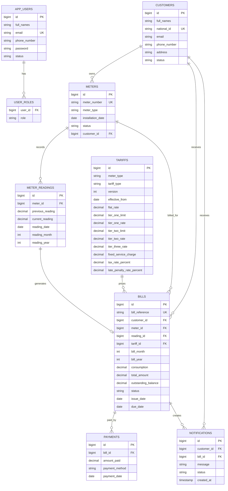
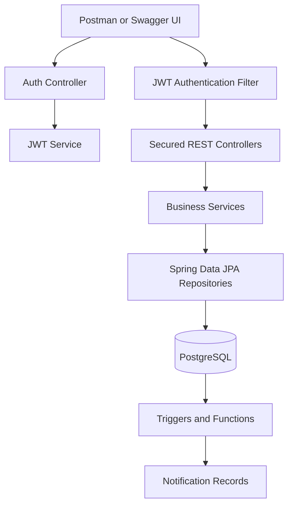

# Utility Billing System

Spring Boot backend for a postpaid utility billing system using Maven, PostgreSQL, Spring Data JPA, JWT security, Swagger UI, and PostgreSQL trigger routines.

## Tech Stack

- Java 21
- Spring Boot 3.5
- Maven
- PostgreSQL
- Spring Security with JWT
- Spring Data JPA / Hibernate
- Swagger UI via Springdoc OpenAPI

## ERD



## Spring Boot Flow Diagram



## Business Rules Implemented

- JWT authentication protects all endpoints except `/api/auth/**` and Swagger documentation.
- Roles supported: `ROLE_ADMIN`, `ROLE_OPERATOR`, `ROLE_FINANCE`, `ROLE_CUSTOMER`.
- Public signup creates `ROLE_CUSTOMER` accounts only.
- Self-registered customers receive an email OTP and must verify before login.
- Admin-created users receive generated temporary credentials by email and must change password after first login.
- Users receive email notifications when their roles are changed.
- Duplicate users, customers, and meter numbers are rejected.
- Inactive customers cannot receive bills.
- Meter readings require active meters, current reading greater than previous reading, and one reading per meter per month/year.
- Tariffs are versioned per meter type and selected by `effectiveFrom`.
- Payments support partial and full settlement.
- Bill status becomes `PAID` when outstanding balance reaches zero.
- PostgreSQL triggers create notifications on bill generation and full payment.

## Setup

1. Create the database:

```sql
CREATE DATABASE ubs_db;
```

2. Update `src/main/resources/application.properties` if your PostgreSQL username or password differs:

3. Run the application:

```bash
mvn spring-boot:run
```

4. Open Swagger UI:

```text
http://localhost:8080/swagger-ui.html
```

## Suggested Test Order

1. Start the app. If no admin exists, `admin@example.com` is created as `ROLE_ADMIN` with temporary password `Admin@12345`.
2. Login with `POST /api/auth/login`.
3. Use the returned JWT in Swagger Authorize as `Bearer <token>`.
4. If `mustChangePassword` is `true`, call `POST /api/auth/change-password`.
5. Optional customer self-signup: call `POST /api/auth/signup`, then verify the emailed OTP with `POST /api/auth/verify-otp`, then login.
6. Create operator, finance, or customer login accounts with `POST /api/users`; the system emails their temporary credentials.
7. Create tariffs with `POST /api/tariffs`.
8. Create a billing customer record with `POST /api/customers`.
9. Create a meter with `POST /api/meters`.
10. Capture a reading with `POST /api/readings`.
11. Generate a bill with `POST /api/bills/generate/{readingId}`.
12. Approve it with `POST /api/bills/{billReference}/approve`.
13. Record payments with `POST /api/payments`.
14. View notifications with `GET /api/notifications/customer/{customerId}`.

## Sample Customer Signup Body

```json
{
  "fullNames": "Customer User",
  "nationalId": "1199880012345678",
  "email": "customer@example.com",
  "phoneNumber": "0788000000",
  "address": "Kigali",
  "password": "customer123"
}
```

After signup, check the customer email for the OTP and verify:

```json
{
  "email": "customer@example.com",
  "otp": "123456"
}
```

## Sample Admin User Creation Body

```json
{
  "fullNames": "Finance Officer",
  "nationalId": "1199880012345679",
  "email": "finance@example.com",
  "phoneNumber": "0788222222",
  "address": "Kigali",
  "status": "ACTIVE",
  "roles": ["ROLE_FINANCE"]
}
```

The created user receives an email containing username, temporary password, assigned roles, role responsibilities, and the login URL.
